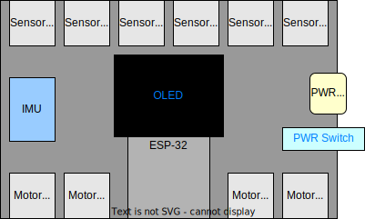

# ZebraBoard Overview

This board diagram shows where to plug in motors, sensors, and power, along with
the major built-in components used by the runtime.

## Ports And Components

- Sensor ports `1` through `6` are along the top edge of the board.
- Motor ports `1` through `4` are along the bottom edge of the board.
- The OLED display sits near the center of the board.
- The IMU is on the left side of the board.
- The ESP-32 module is near the lower center.
- The power plug and power switch are on the right side.

Use the student API pages for code examples:

- [Motor](student-api/motor.md)
- [Sensor ports](student-api/sensor-ports.md)
- [Display and notifications](student-api/display-notifications.md)
- [IMU](student-api/imu.md)
