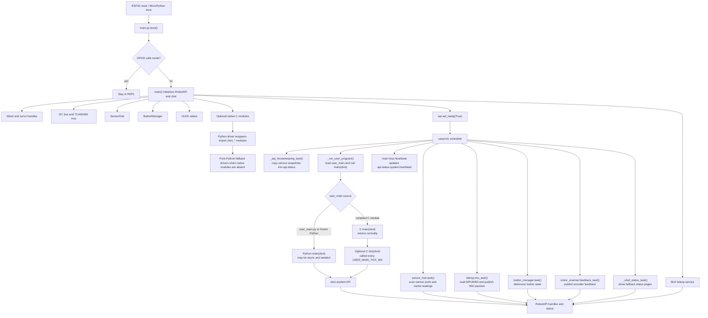
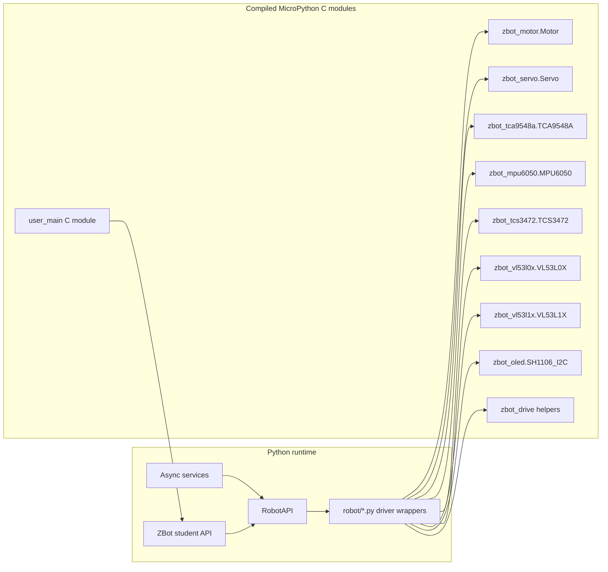

# Runtime Architecture

This guide documents the project-owned runtime files and the default ZebraBot
execution model. It intentionally excludes most vendored source under
`build_tools/`; those files belong to upstream MicroPython and ESP-IDF. The
firmware artifacts produced by this project are called out separately below.

## Default Runtime Flow

`main.py` is the device entry point. It creates the shared `RobotAPI`, wraps it
with the student-facing `ZBot` object, initializes hardware services, and then
starts cooperative `uasyncio` tasks. All long-running runtime work should yield
with `await asyncio.sleep_ms(...)` so other services keep running.

## Async Loop Responsibilities

The default firmware has one MicroPython `uasyncio` event loop. Each runtime
service is a cooperative task on that loop:

- `sensor_hub.task()` scans enabled sensor mux ports, detects supported I2C
  devices, polls distance/color sensors, and keeps a snapshot cache.
- `teleop.imu_task()` reads IMU samples and emits telemetry packets when BLE
  telemetry is available.
- `motor_scanner.feedback_task()` publishes encoder feedback. The active motor
  scan loop exists, but is disabled during normal user runtime.
- `button_manager.task()` debounces configured button GPIOs and publishes button
  snapshots.
- `_api_housekeeping_task()` refreshes shared status dictionaries from service
  caches and reads a local IMU snapshot.
- `_oled_status_task()` displays boot, fallback, and sensor overview pages when
  user code is not actively using the OLED.
- `_run_user_program()` imports `user_main`, calls `main(zbot)`, awaits Python
  coroutines, or repeatedly calls native `tick(zbot)` when present.
- The final loop in `main()` increments the heartbeat every five seconds.

Tasks share state through `RobotAPI.status` and service handles registered with
`RobotAPI.register_handle(...)`. There is no preemptive threading in the project
runtime; blocking loops in Python or C will starve the scheduler.

## Python And C Runtime Boundary

The Python runtime always exposes the same `zbot` object to user code. The user
program can be a filesystem/frozen Python module or a native MicroPython C
module named `user_main`.

Native driver modules are optional acceleration and packaging layers. The
Python wrappers import them first and fall back to pure-Python behavior where a
fallback exists. Native `user_main.c` is different: it is user behavior compiled
into firmware, and it calls back into the same `zbot` methods Python students
use.

## Project File Map

### Top Level

- `README.md`: Project overview and documentation index.
- `main.py`: MicroPython boot entry point, hardware initialization, shared
  `RobotAPI`, student-facing `ZBot`, task registration, and user program loader.
- `tree.txt`: Captured repository tree/reference output.
- `.gitattributes`: Git text/binary attribute settings.

### Documentation

- `docs/board-overview.md`: Student-facing board diagram and port/component
  location guide.
- `docs/assets/zebra-board.svg`: SVG render of the ZebraBoard layout.
- `docs/student-api.md`: Student-facing `zbot` API index for motors, servos,
  drive helpers, buttons, sensors, display, notifications, and status snapshots.
- `docs/student-api/*.md`: One student API topic per document, including sensor
  ports, ToF, color, RGB, palette, and snapshot guide pages.
- `docs/build-deploy.md`: Firmware build, flash, runtime restore, and native
  module verification workflow.
- `docs/runtime-architecture.md`: This runtime architecture and file map.

### Build Artifacts And Vendored Tooling

- `build_tools/zbot_firmware/bootloader.bin`: ESP32 bootloader artifact copied
  from the MicroPython firmware build.
- `build_tools/zbot_firmware/partition-table.bin`: ESP32 partition table
  artifact copied from the MicroPython firmware build.
- `build_tools/zbot_firmware/micropython.bin`: ZebraBot MicroPython firmware
  image with the configured native modules.
- `build_tools/micropython/`: Vendored or local MicroPython checkout used for
  firmware builds.
- `build_tools/esp-idf/`: Vendored or local ESP-IDF checkout used by the ESP32
  MicroPython port.

### Python Runtime Modules

- `robot/__init__.py`: Marks `robot` as the runtime support package.
- `robot/config.py`: Hardware pin map, motor/servo port maps, BLE name, I2C mux,
  OLED, IMU, sensor hub, motor telemetry, and button constants.
- `robot/motors.py`: Motor driver import shim; prefers `zbot_motor.Motor`.
- `robot/servo.py`: Servo driver import shim; prefers `zbot_servo.Servo`.
- `robot/tca9548a.py`: TCA9548A I2C mux import shim; prefers the native module.
- `robot/mpu6050.py`: MPU6050 IMU import shim; prefers the native module.
- `robot/vl53l0x.py`: VL53L0X distance sensor import shim; prefers the native
  module.
- `robot/vl53l1x.py`: VL53L1X distance sensor import shim; prefers the native
  module.
- `robot/oled_status.py`: OLED wrapper/status display support and temporary BLE
  connection messages.
- `robot/sensor_hub.py`: Sensor mux scanning, sensor detection, ToF/color
  polling, color classification, telemetry notifications, and sensor snapshots.
- `robot/button.py`: Debounced button wrappers, null button fallback, and async
  button manager.
- `robot/ble_teleop.py`: BLE UART service, telemetry queue, command handling,
  file upload support, OLED connection notices, and IMU telemetry loop.
- `robot/motor_feedback.py`: Encoder feedback snapshot support used by motor
  telemetry.
- `robot/motor_scan.py`: Optional motor pulse scanner and active feedback
  telemetry task.
- `robot/debug_io.py`: Serial/BLE debug logging, boot log replay, diagnostics,
  and exception packetization.
- `robot/error_report.py`: Exception and text packet formatting helpers.
- `robot/base_drive.py`: Minimal base drive class for simple drive abstractions.
- `robot/differential.py`: Student-facing differential/tank drive helper.
- `robot/ackermann.py`: Student-facing Ackermann drive helper with optional IMU
  heading reference.
- `robot/drivetrain.py`: Legacy differential drive helper using optional native
  `zbot_drive` mixing.
- `robot/drive_models.py`: Unified differential and Ackermann drive model
  classes plus the `DriveSystem` factory.
- `robot/drivetrain_unified.py`: Backward-compatible re-export of the unified
  drive model types.

### Native MicroPython C Modules

- `micropython/cmodules/micropython.cmake`: Aggregate CMake entry point that
  includes both native driver modules and the optional native user program.
- `micropython/cmodules/zbot_drivers/README.md`: Native driver module build and
  API overview.
- `micropython/cmodules/zbot_drivers/micropython.cmake`: CMake registration for
  the native ZebraBot driver modules.
- `micropython/cmodules/zbot_drivers/zbot_motor.c`: `zbot_motor.Motor` PWM and
  direction driver with `set`, `set_power`, `stop`, `power`, and `deinit`.
- `micropython/cmodules/zbot_drivers/zbot_servo.c`: `zbot_servo.Servo` PWM
  servo driver with `angle`, `write_angle`, and `deinit`.
- `micropython/cmodules/zbot_drivers/zbot_tca9548a.c`: `zbot_tca9548a.TCA9548A`
  I2C mux driver with `select`, `disable_all`, and `current_channel`.
- `micropython/cmodules/zbot_drivers/zbot_mpu6050.c`: `zbot_mpu6050.MPU6050`
  IMU driver with raw and scaled readings.
- `micropython/cmodules/zbot_drivers/zbot_tcs3472.c`: `zbot_tcs3472.TCS3472`
  color sensor driver returning clear/R/G/B values.
- `micropython/cmodules/zbot_drivers/zbot_vl53l0x.c`: `zbot_vl53l0x.VL53L0X`
  ToF driver with continuous/single reads and debug snapshots.
- `micropython/cmodules/zbot_drivers/zbot_vl53l1x.c`: `zbot_vl53l1x.VL53L1X`
  ToF driver with start/stop, data-ready, raw/debug reads, and `read`/`ping`.
- `micropython/cmodules/zbot_drivers/zbot_oled.c`: `zbot_oled.SH1106_I2C`
  display driver built on MicroPython `framebuf`.
- `micropython/cmodules/zbot_drivers/zbot_drive.c`: Native drive math helpers
  for clamping, differential mixing, and duty conversion.
- `micropython/cmodules/user_main/README.md`: Beginner-friendly guide for
  writing a native C `user_main` program.
- `micropython/cmodules/user_main/micropython.cmake`: CMake registration for the
  optional native `user_main` module.
- `micropython/cmodules/user_main/micropython.mk`: Make registration for the
  optional native `user_main` module.
- `micropython/cmodules/user_main/user_main.c`: Example native user program that
  exports `USER_MAIN_KIND`, `USER_MAIN_TICK_MS`, `main(zbot)`, and `tick(zbot)`.

## Documentation Rules For New Files

When adding project-owned files, update this file map and link any new public
behavior from the nearest user-facing guide:

- student/user behavior belongs in `docs/student-api.md`
- sensor behavior belongs in `docs/student-api/`
- firmware build/deploy behavior belongs in `docs/build-deploy.md`
- native module APIs belong in `micropython/cmodules/zbot_drivers/README.md`
- native user-program workflow belongs in `micropython/cmodules/user_main/README.md`
